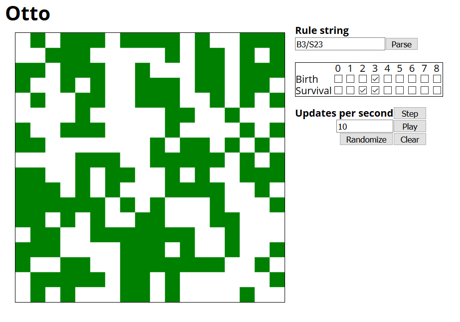

# Otto

A program intended to help visualize different cellular automaton rules.

Otto simulates a cellular automaton on a toroidal game board (one where the top
edge connects to the bottom edge and the left connects to the right) with
user-defined birth and death rules.




# Usage

This app is intended to be served as a static webpage from the `public/`
directory. For example, you can use the `http-server`
[package on npm][http_server]:

```
cd public/
npx http-server
```

[http_server]: https://www.npmjs.com/package/http-server

## User interface

The left side shows the current state of the cellular automaton, with dead
cells rendered in white and live cells rendered in green. Clicking on a cell
will toggle it between being alive and being dead.

The right side shows an array of controls for the cellular automaton. There are
three major components, in order form top to bottom: The rule string controls,
the rule box, and the automaton state controls.

The rule string controls allow one to enter a rule string in one of two
formats: [Mirek's Cellebration][mirek], and [Golly][golly]. The Mirek's
Cellebration format is of the form "x/y", where x and y are sequences of digits
between 0 and 8. The Golly format is of the form "Bx/Sy" where x and y are as
before. In both formats, x gives the birth rule for the cellular automaton and
y gives the survival rule. To submit the rule after entering it in the text
field, either hit Enter or press the "Parse" button.

The rule box allows one to see or set the automaton's rules using checkboxes.
Each column corresponds to a number of neighbors; thus, a check in the survival
row under the column '3' means that a living cell will survive the next step if
it has three living neighbors.

The automaton state controls allow one to control the state of the automaton.
The step button causes the automaton to advance one step following its defined
birth and survival rules. The play button causes the automaton to advance a
fixed number of steps per second, following the number entered in the "updates
per second" field. If this number is negative or zero, it will ignore the
number and update at a rate of 10 updates per second. The clear button sets all
automaton cells to the dead state. Finally, the randomize button will replace
the current automaton state with a randomly generated one.

[mirek]: https://en.wikipedia.org/wiki/Mirek%27s_Cellebration
[golly]: https://en.wikipedia.org/wiki/Golly_(program)
