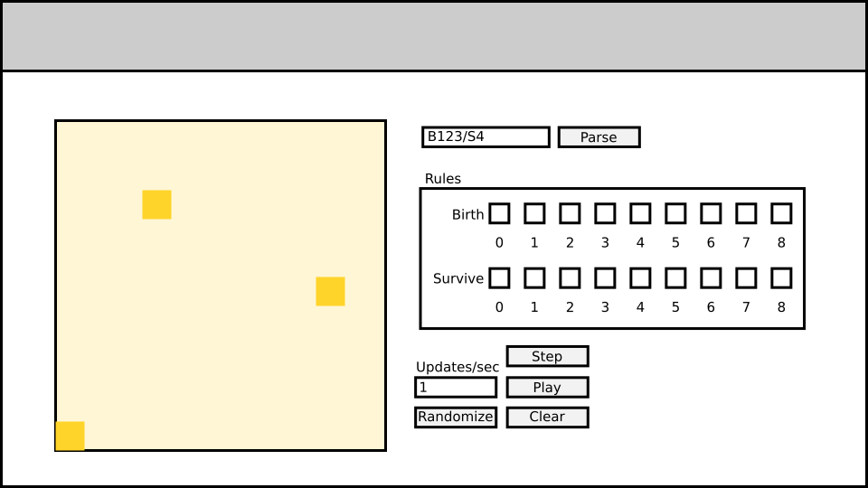

# Otto

A program intended to help visualize different cellular automaton rules.

Otto simulates a cellular automaton on a toroidal game board (one where the top
edge connects to the bottom edge and the left connects to the right) with
user-defined birth and death rules.




# Usage

This app is intended to be served as a static webpage from the `public/` directory. For example, you can use the `http-server` [package on npm][http_server]:

```
cd public/
npx http-server
```
